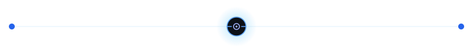
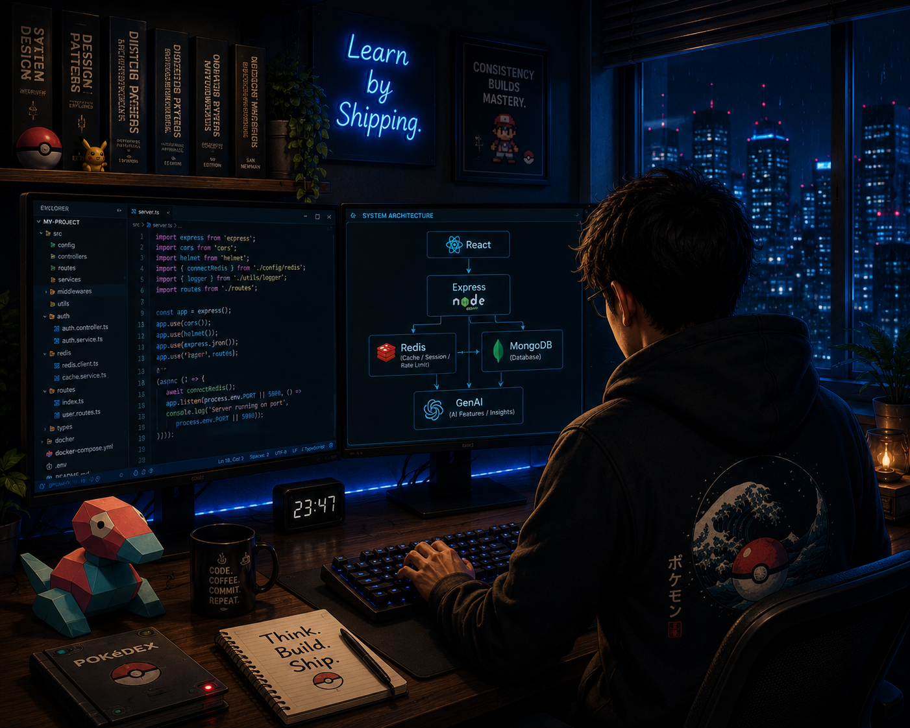
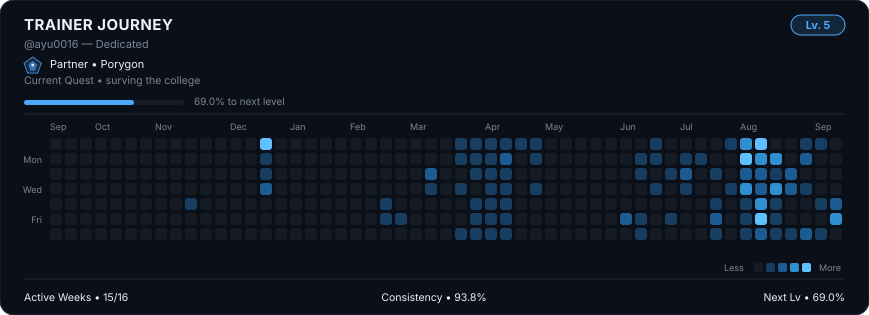

<!-- ========================================================= -->
<!--                     AYUSH RASTOGI                         -->
<!--              Full Stack Engineer | GenAI                  -->
<!-- ========================================================= -->

  

 **Curious • Consistent • Builder**

<i>Learn by Shipping.</i>

<!-- 

 -->

---

<h1 align="center"> About Me </h1>

<table align="center" width="100%" cellspacing="0" cellpadding="12" style="border:1px solid #30363d; border-radius:10px;">

<tr>

<td width="64%" valign="top" style="border-right:1px solid #30363d;">

-  Full Stack Developer passionate about building modern web apps.

-  Currently learning **System Design, Cloud & DevOps**.
-  Building **AI-powered** projects and contributing to **Open Source**.
-  Goal: Create products that solve real-world problems.
-  Curious about scalable backend systems and **GenAI**.
-  Gamer when I'm not coding.

</td>

<td width="36%" align="center" valign="middle" >

</td>

</tr>

</table>

<!--  -->
---

<h1>  Engineering Toolkit </h1>

<!--  -->
---

<!--  -->

<h1> Trainer Journey  </h1>

 

<!-- Auto-generated daily by .github/workflows/trainer-journey.yml — see the
     trainer-journey project README for setup. Do not edit this line manually. -->

<!-- # 🚀 Currently Building

- **Event Hub**
- **SyncSpace**

---

# 📖 Developer Pokédex

| Project | Description |
|---------|-------------|
| Event Hub | *Coming Soon* |
| SyncSpace | *Coming Soon* |
| URL Shortener | *Coming Soon* |
| Weather Website | *Coming Soon* |

---

# ⚡ Training Arc

- Microservices Architecture
- Docker
- Distributed Systems
- GenAI
- System Design

---

 -->
<!--  -->
---
<h1 align="center"> Achievements</h1>

---
<h1 align="center">Let's Connect</h1>

---

### *Building. Learning. Shipping.*

