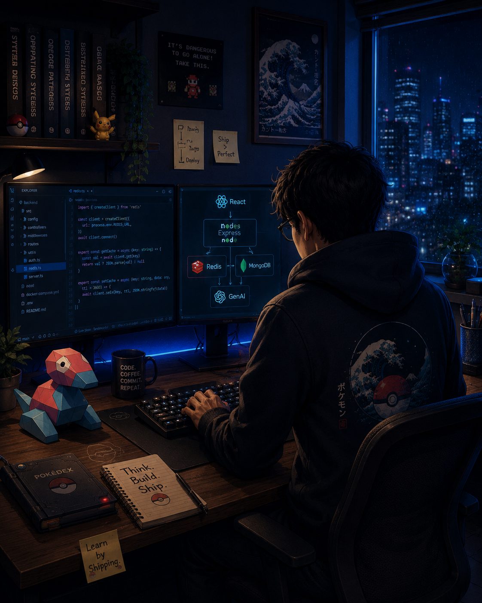

<!-- ========================================================= -->
<!--                     AYUSH RASTOGI                         -->
<!--              Full Stack Engineer | GenAI                  -->
<!-- ========================================================= -->

<table>
<tr>

<td width="32%" valign="top">

</td>

<td width="68%" valign="top">

# Hi, I'm Ayush 👋

Building production-ready software with modern web technologies while exploring backend architecture, distributed systems, and GenAI.

> **Learn by Shipping.**

</td>

</tr>
</table>

---

# About Me

- 💻 Aspiring Software Development Engineer
- 🚀 Passionate about building products instead of tutorials
- 🧠 Curious about scalable backend systems and GenAI
- 🎮 Gamer
- 📍 India

---

# ⚙️ Engineering Toolkit

### Languages

  

### Frontend

  

  
  
  

### Backend

  

  
  

### Databases

  

### AI / GenAI

  
  
  
  

### DevOps & Deployment

  

  

### Tools

  

  

---

# 🚀 Currently Building

- **Event Hub**
- **SyncSpace**

---

# 📖 Developer Pokédex

| Project | Description |
|---------|-------------|
| Event Hub | *Coming Soon* |
| SyncSpace | *Coming Soon* |
| URL Shortener | *Coming Soon* |
| Weather Website | *Coming Soon* |

---

# ⚡ Training Arc

- Microservices Architecture
- Docker
- Distributed Systems
- GenAI
- System Design

---

# 🏅 Gym Badges

🏆 Smart India Hackathon Finalist

💙 GDG Programmer

💙 GDG Developer

---

# 🤝 Let's Connect

---

### *Building. Learning. Shipping.*

